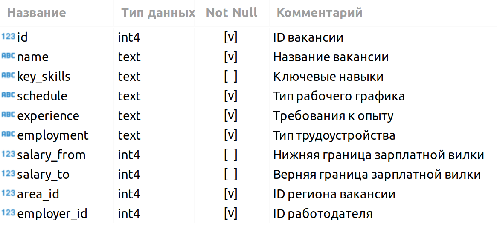

# Анализ вакансий с сайта *hh.ru*

## Содержание
[1. Описание](#описание)

[2. Задачи](#задачи)

[3. Краткая информация о данных](#информация-о-данных)

[4. Этапы](#этапы)

[5. Результат](#результат)

### Описание
Проект на платформе ***[Skillfactory](https://skillfactory.ru/)*** по закреплению знаний по темам:
 - SQL;
 - подгрузка данных;
 - работа с данными в Pandas.

### Задачи
Для создания модели машинного обучения, которая будет рекомендовать вакансии клиентам агентства, претендующим на позицию Data Scientist необходимо понять, что из себя представляют данные и насколько они соответствуют целям проекта. В литературе эта часть работы над ML-проектом называется Data Understanding, или анализ данных.

Задание состоит из блоков практических заданий, которые необходимо выполнить в jupyter-ноутбуке.

### Информация о данных
Данные представляют собой 5 SQL-таблицы, объединенных в схему:

#### VACANCIES
Таблица хранит в себе данные по вакансиям и содержит следующие столбцы:

#### AREAS
Таблица-справочник, которая хранит код региона и его название:

#### EMPLOYERS
Таблица-справочник со списком работодателей:

#### INDUSTRIES
Таблица-справочник вариантов сфер деятельности работодателей:

#### EMPLOYERS_INDUSTRIES
Дополнительная таблица, которая существует для организации связи между работодателями и сферами их деятельности:

### Этапы
1. Знакомство с данными.
2. Предварительный анализ данных.
3. Детальный анализ вакансий.
4. Анализ работодателей.
5. Предметный анализ.

### Результат
- проведен предварительный анализ данных из таблиц в схеме;
- проведен анализ вакансий в разрезе разных признаков;
- проведен анализ работодателй в разрезе регионов, сфер деятельности и количества предлагаемых вакансий;
- обозначены критерии для поиска вакансий на должность DS специалиста, произведена выборка и анализ таках вакансий;
- сформированы критерии для написания и реализована [функция](function_for_search.ipynb) по подобору вакансий.
